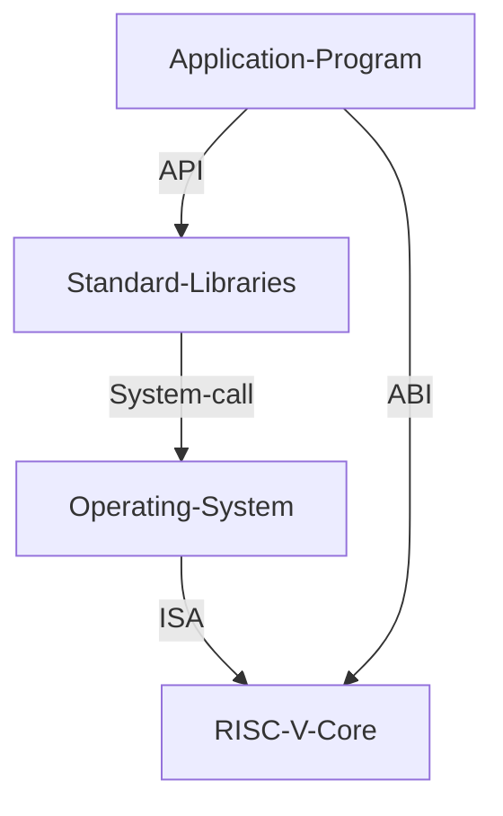
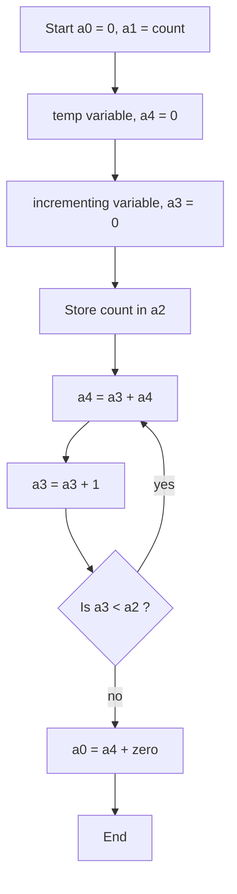
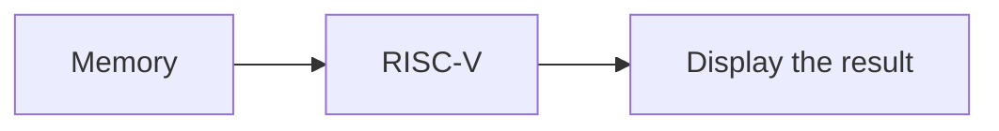

# Table of Contents

- [Table of Contents](#table-of-contents)
  - [Day 1 Introduction to RISC - V ISA and GNU compiler toolchain](#day-1-introduction-to-risc---v-isa-and-gnu-compiler-toolchain)
    - [RISC - V ISA](#risc---v-isa)
      - [Intro to ISA](#intro-to-isa)
      - [From Apps to Hardware](#from-apps-to-hardware)
      - [Types of instruction](#types-of-instruction)
    - [Lab for software toolchain](#lab-for-software-toolchain)
      - [C Program to compute Sum from 1 to N](#c-program-to-compute-sum-from-1-to-n)
        - [C code](#c-code)
        - [Command to execute](#command-to-execute)
      - [gcc compiler and dissassemble](#gcc-compiler-and-dissassemble)
        - [Normal speed](#normal-speed)
        - [Fast](#fast)
      - [Spike simulation and debug](#spike-simulation-and-debug)
        - [Debugging](#debugging)
    - [Number systems](#number-systems)
      - [64-bit Number system](#64-bit-number-system)
      - [Signed number representation](#signed-number-representation)
      - [Lab for signed and unsigned magnitude](#lab-for-signed-and-unsigned-magnitude)
  - [Day 2 - Application Binary Interface and verification flow](#day-2---application-binary-interface-and-verification-flow)
    - [Application Binary Interface (ABI)](#application-binary-interface-abi)
      - [Intro to ABI](#intro-to-abi)
      - [Memory Allocation for double words](#memory-allocation-for-double-words)
      - [Load, Add and Store instructions](#load-add-and-store-instructions)
      - [RV64I registers and their ABI Names](#rv64i-registers-and-their-abi-names)
    - [Labs using ABI function call](#labs-using-abi-function-call)
      - [Sum of N numbers Flowchart](#sum-of-n-numbers-flowchart)
      - [Assembly Function Call](#assembly-function-call)
        - [Assembly code for the sum of N](#assembly-code-for-the-sum-of-n)
        - [C program to call the assembly code](#c-program-to-call-the-assembly-code)
        - [Compiling through a RISC-V core](#compiling-through-a-risc-v-core)
    - [Passing the C program as a HEX file](#passing-the-c-program-as-a-hex-file)

## Day 1 Introduction to RISC - V ISA and GNU compiler toolchain

### RISC - V ISA

#### Intro to ISA

#### From Apps to Hardware


#### Types of instruction


- Pseudo Instructions
- RV64I
- RV64M
- RV64F, RV64D
- RV64-IMFD

Application Binary Interface - System calls through which the programmers can access the registers of the RISC - V Core
Memory allocation and stack pointer

### Lab for software toolchain

#### C Program to compute Sum from 1 to N

##### C code

```c
#include <stdio.h>

int main () {
  int i = 0, sum = 0;
  int n = 10;
  for (i = 1; i < n; ++i) {
    sum += i;
  }
  
  printf("\nSum of numbers from 1 to %d = %d\n", n, sum);
  return 0;
}
```

##### Command to execute

```console
gcc sumofn.c -o sumofn
./sumofn
```


#### gcc compiler and dissassemble

- Now we run the compiled code in a test RISC - V Core

##### Normal speed

```console
riscv64-unknown-elf-gcc -O1 -mabi=lp64 -march=rv64i -o sumofn.o sumofn.c
riscv64-unknown-elf-objdump -d sumofn.o | less
```


Number of instructions =

##### Fast

```console
riscv64-unknown-elf-gcc -Ofast -mabi=lp64 -march=rv64i -o sumofn.o sumofn.c
riscv64-unknown-elf-objdump -d sumofn.o | less
```


#### Spike simulation and debug


This command is used for displaying the program after it gets executed by the RISC - V core.

```console
spike pk sumofn.o
```

Debug command

```console
spike pk -d sumofn.o

```

This command will run all the instructions until 100b0 Address

```console
until pc 0 100b0
```

This command is used for the checking the content of a register

```console
reg 0 a0
```

##### Debugging


- Here the value of the immediate 0x00021000 is loaded into the r0 register


- Here the value of stack pointer is decreased by -10 in hex.

### Number systems

#### 64-bit Number system

- 8 bits => 1 byte
- 4 bytes => 1 word
- 8 bytes => 2 words

number of combinations using n bits => $2^n$


Highest number represented by 64-bit system => $(2^64) - 1$

#### Signed number representation

#### Lab for signed and unsigned magnitude

## Day 2 - Application Binary Interface and verification flow

### Application Binary Interface (ABI)

#### Intro to ABI


- ABI is the system-call interface present between the software application and the registers of the ISA
- It can be used to access the registers through system calls



- There are 32 registers each of 64 bits in the RV64.

#### Memory Allocation for double words

- Memory is **byte-addressable**
- Each address contains 8 - bits (i.e.) - 1 byte
- RISC - V follows little-endian memory system.
- MSB bits have higher memory address and LSB have lower memory address

#### Load, Add and Store instructions


#### RV64I registers and their ABI Names

- Load, add and store belong to $RV64I$ base instructions.
- Load is a I-type instruction
- Add is a R-type instruction
- Store is a S-type instruction
- $rd$ is of size 5 bits => So $2^5 = 32$ registers
- Naming convention is $x0$ to $x31$


### Labs using ABI function call

#### Sum of N numbers Flowchart



- Value of a0 is returned to the main program.

#### Assembly Function Call

##### Assembly code for the sum of N

```assembly
.section .text
.global load
.type load, @function

load:
  add a4, a0, zero // a4 - sum register
  add a2, a0, a1   // a2 - count register, n
  add a3, a0, zero // a3 - intermediate register, i
  
loop:
  add a4, a3, a4 // add a3 to a4 every loop
  add a3, a3, 1  // increment a3 by 1
  blt a3, a2, loop // loop back as long as i < n
  add a0, a4, zero // store result in a0
  ret  
```

##### C program to call the assembly code

```c
#include <stdio.h>

extern int load(int x, int y);

int main () {
 int result = 0;
 int count = 10;
 result = load(0x0, count+1);
 printf("Sum of numbers from 1 to %d is %d\n", count, result);
 return 0;
} 
```


##### Compiling through a RISC-V core

```console
riscv64-unknown-elf-gcc -Ofast -mabi=lp64 -march=rv64i -o sumof_N.o sumof_N.c load.S
spike pk sumof_N.o
```


### Passing the C program as a HEX file



```console
git clone https://github.com/kunalg123/riscv_workshop_collaterals.git
```

```console
chmod 377 rv32im.sh
./rv32im.sh
```

- The instructions that we want to run are passed as HEX files into the RISC - V core


## Day 3 - Digital Logic with TL-Verilog and Makerchip 

### Combinational Logic

#### Basic logic gates

#### Mux

#### Labs using Makerchip

##### Pipelined Pythagorean Example


##### Basic Logic Gates Example
- Load Default template


```verilog
$reset = *reset;

$out1 = ~$in1;  // NOT
$out2 = $in1 || $in2; // bitwise - OR
$out3 = $in1 && $in2; // bitwise - AND
$out4 = $in1 ^ $in2; // bitwise - XOR
$out5 = ~($in1 ^ $in2); // bitwise - XNOR
```

##### Vectors

- Code
```verilog
$out[4:0] = $in1[3:0] + $in2[3:0];
```

- Output Waveform


##### Mux

- 2x1 Mux
 
```verilog
$out = $sel ? $in1 : $in0; // 2x1 MUX
```

- Output Waveform
 


- 2x1 Mux (vector)
 
```verilog
$out[7:0] = $sel ? $in1[7:0] : $in0[7:0]; // 2x1 MUX
```

- Output Waveform


##### Combinational Calculator

- Code

```verilog
   $reset = *reset;


   // YOUR CODE HERE
   $val1[31:0] = $rand1[3:0];
   $val2[31:0] = $rand2[3:0];

   $sum[31:0] = $val1 + $val2;  //00
   $diff[31:0] = $val1 - $val2; //01
   $prod[31:0] = $val1 * $val2; //10
   $quot[31:0] = $val1 / $val2; //11

   $out[31:0] = ($op[1:0] == 2'b00) ? $sum :
               ($op[1:0] == 2'b01) ? $diff :
               ($op[1:0] == 2'b10) ? $prod :
               ($op[1:0] == 2'b11) ? $quot : 32'b0;
```

- Output Waveform


### Sequential Logic

- Present state depends on past state.
- Memory is associated with sequential logic.
- It retains its value till a clock edge or (level comes).

#### Finite State Machine


#### Fibonacci Series implmenetation

- Code

```
$num[31:0] = $reset ? 1 : (>>1$num + >>2$num);
```

- Output Waveform


#### Up-counter implementation

- Code

```
$num[31:0] = $reset ? 0 : (>>1$num + 1);
```

- Output Waveform


#### Sequential Calculator

- Here the last output becomes one of the present input.

- Code

```verilog
   $reset = *reset;


   //$val1[31:0] = $rand1[3:0];
   $val2[31:0] = $rand2[3:0];

   //$num[31:0] = $reset ? 0 : (>>1$num + 1);

   $sum[31:0] = $out + $val2;  //00
   $diff[31:0] = $out - $val2; //01
   $prod[31:0] = $out * $val2; //10
   $quot[31:0] = $out / $val2; //11

   $tout[31:0] = ($op[1:0] == 2'b00) ? $sum :
                  ($op[1:0] == 2'b01) ? $diff :
                  ($op[1:0] == 2'b10) ? $prod :
                  ($op[1:0] == 2'b11) ? $quot : 32'b0;

   $out[31:0] = $reset ? 0 : >>1$tout;
```

- Output Waveform


### Pipelined Logic

#### Intro to Pipelining and Re - timing

- We divide the long combinational circuit into smaller parts by inserting registers.
- Each smaller part has less propagation delay.
- So now each stage can be executed at higher frequency.
- Pipelining allows us to overlap the execution of one instruction with the earlier stage of another instruction.
- It increases system response time, as we don't need to wait till the entire instruction is executed.

##### Re-timing
- We can move the flip flops to achieve equal delays in each stage.


#### Benefits of pipelining

- Max. frequency of the clock, depends on the propagation delay between flip flops.
- By inserting more flip flops, the propagation delay reduces
- It increases the throughtout 

#### Pipelined fibo series implementation


- Everything in TL-Verilog is implicitly pipelined.
- This fibo implementation is equivalent to the earlier implementation.


#### Error Conditions within Computation Pipeline

- Code
```verilog
   $reset = *reset;

   //...
   |comp
      @1
         $err1 = $bad_input + $illegal_op;
         
      @3
         $err2 = $over_flow + $err1;
      @6
         $err3 = $div_by_zero + $err2;   
```

- Output Waveform


#### 2-Cycle Calculator


i. First we shall include the counter and calculator in the first stage.


ii. Change alignment of $out to have two cycle latency


- Code
```verilog

```
