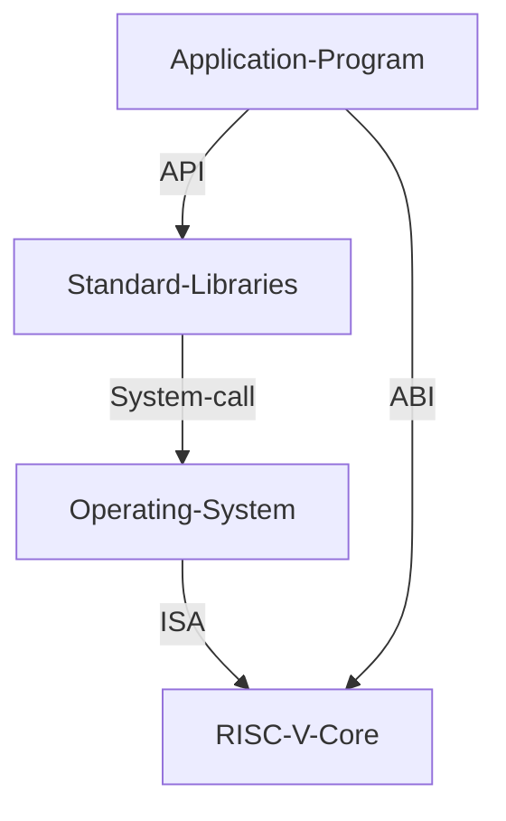

# Day 1 Introduction to RISC - V ISA and GNU compiler toolchain

## RISC - V ISA

### Intro to ISA

### From Apps to Hardware


### Types of instruction


- Pseudo Instructions
- RV64I
- RV64M
- RV64F, RV64D
- RV64-IMFD

Application Binary Interface - System calls through which the programmers can access the registers of the RISC - V Core
Memory allocation and stack pointer

## Labs

### C Program to compute Sum from 1 to N

#### C Program file
```c
#include <stdio.h>

int main () {
  int i = 0, sum = 0;
  int n = 10;
  for (i = 1; i < n; ++i) {
    sum += i;
  }
  
  printf("\nSum of numbers from 1 to %d = %d\n", n, sum);
  return 0;
}
```

#### Command to execute
```console
gcc sumofn.c -o sumofn
./sumofn
```


### gcc compiler and dissassemble

- Now we run the compiled code in a test RISC - V Core
- 
#### Normal speed
```console
riscv64-unknown-elf-gcc -O1 -mabi=lp64 -march=rv64i -o sumofn.o sumofn.c
riscv64-unknown-elf-objdump -d sumofn.o | less
```


Number of instructions = 

#### Fast

```console
riscv64-unknown-elf-gcc -Ofast -mabi=lp64 -march=rv64i -o sumofn.o sumofn.c
riscv64-unknown-elf-objdump -d sumofn.o | less
```


### Spike simulation and debug


```console
spike pk sumofn.o
```
This command is used for displaying the program after it gets executed by the RISC - V core.

```console
until pc 0 100b0
```
This command will run all the instructions until 100b0 Address

```console
reg 0 a0
```
This command is used for the checking the content of a register

#### Debugging


- Here the value of the immediate 0x00021000 is loaded into the r0 register


- Here the value of stack pointer is decreased by -10 in hex. 


### Number systems

#### 64-bit Number system

- 8 bits => 1 byte
- 4 bytes => 1 word
- 8 bytes => 2 words

number of combinations using n bits => $2^n$


Highest number represented by 64-bit system => $(2^64) - 1$

#### Signed number representation
#### Lab for signed and unsigned magnitude

# Day 2 - Application Binary Interface and verification flow

## Application Binary Interface (ABI)
### Intro to ABI


- ABI the interface present between the software application and the registers of the ISA
- It can be used to access the registers through system calls




- There are 32 registers each of 64 bits in the RV64.

### Memory Allocation for double words

- Memory is **byte-addressable**
- Each address contains 8 - bits (i.e.) - 1 byte
- RISC - V follows little-endian memory system.
- MSB bits have higher memory address and LSB have lower memory address

### Load, Add and Store instructions


### RV64I registers and their ABI Names

- Load, add and store belong to RV64I base instructions.
- Load is a I-type instruction
- Add is a R-type instruction
- Store is a S-type instruction
- rd is of size 5 bits => So $2^5 = 32$ registers
- Naming convention is x0 - x31


## Labs using ABI function call

### Sum of N numbers Flowchart


### Assembly code for sum of N numbers

```assembly
.section .text
.global load
.type load, @function

load:
		add a4, a0, zero // a4 - sum register
		add a2, a0, a1   // a2 - count register, n
		add a3, a0, zero // a3 - intermediate register, i
		
loop:
		add a4, a3, a4	// add a3 to a4 every loop
		add a3, a3, 1 	// increment a3 by 1
		blt a3, a2, loop	// loop back as long as i < n
		add a0, a4, zero	// store result in a0
		ret		
```

#### C program to call the assembly code
```c
#include <stdio.h>

extern int load(int x, int y);

int main () {
	int result = 0;
	int count = 10;
	result = load(0x0, count+1);
	printf("Sum of numbers from 1 to %d is %d\n", count, result);
	return 0;
}	
```


#### Debug the code

```console
riscv64-unknown-elf-gcc -Ofast -mabi=lp64 -march=rv64i -o sumof_N.o sumof_N.c load.S
spike
```


## Running c program on a test RISC-V core


```console
git clone https://github.com/kunalg123/riscv_workshop_collaterals.git
```

```console
chmod 377 rv32im.sh
./rv32im.sh
```

- The instructions that we want to run are passed as HEX files into the RISC - V core


